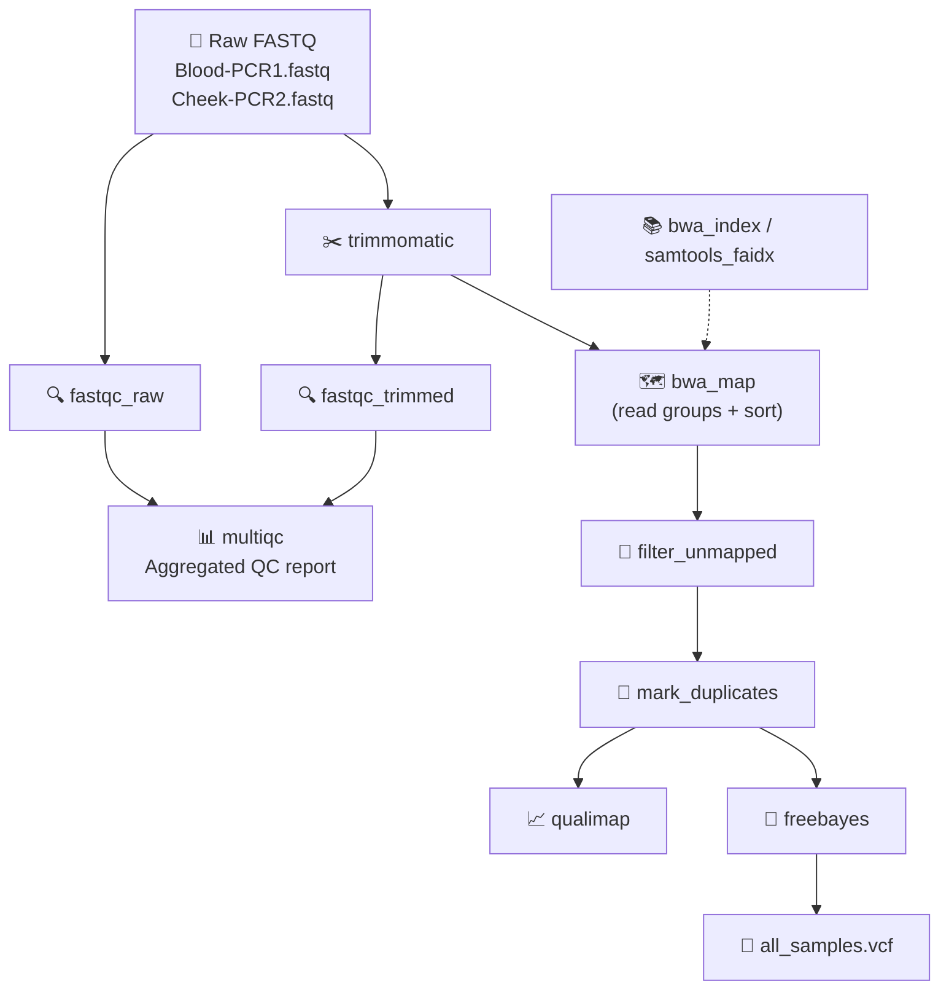

# 🧬 mtDNA Blood Samples (NGS; Snakemake)


> **Reproducible Snakemake workflow for calling variants from human mitochondrial DNA sequencing data.**  
> Processes single-end reads from blood and cheek-swab samples through QC, trimming, mapping, duplicate removal, and multi-sample variant calling.

[](https://snakemake.readthedocs.io/)
[](https://github.com/conda-forge/miniforge)
[](LICENSE)
[]()

---

## 📖 Start Here

**New to this pipeline?** Read the **Quick Start** and **Input Data** sections below before running anything.  
If you are new to Snakemake, you may also want to skim the official [Snakemake tutorial](https://snakemake.readthedocs.io/en/stable/tutorial/tutorial.html) first — this repository follows the same layout (`config/`, `envs/`, `workflow/Snakefile`).

---

## 🎯 What This Pipeline Does

| Step | Rule | Tool | What you get |
|------|------|------|--------------|
| **QC (raw)** | `fastqc_raw` | FastQC | Per-sample quality metrics of raw reads |
| **Trimming** | `trimmomatic` | Trimmomatic SE | Sliding-window quality trimming |
| **QC (trimmed)** | `fastqc_trimmed` + `multiqc` | FastQC, MultiQC | Aggregated QC report before/after trimming |
| **Mapping** | `bwa_map` | BWA-MEM | Reads mapped to `chrM.fa` with explicit read groups, sorted |
| **Filter** | `filter_unmapped` | SAMtools | Unmapped reads removed (`-F 4`) |
| **Deduplication** | `mark_duplicates` | SAMtools | PCR / optical duplicates removed |
| **Mapping QC** | `qualimap` | QualiMap | Per-sample mapping-quality report |
| **Variant calling** | `freebayes` | FreeBayes | Single multi-sample VCF (`all_samples.vcf`) |
| **Visual inspection** | *(manual)* | IGV | Confirm variants and read support |

Two reference-prep rules (`bwa_index`, `samtools_faidx`) run automatically if the BWA index or `.fai` are missing.

---

## 🗺️ Analysis Workflow



---

## 🚀 Quick Start

### 1. Requirements

- Linux (or WSL2 on Windows)
- [Miniforge / Mamba](https://github.com/conda-forge/miniforge)
- Snakemake 8+

Install the driver environment:

```bash
mamba env create -f environment.yml
conda activate mtdna-snakemake
snakemake --version
```

### 2. Download input data

The raw data is **not tracked** in this repository (see `.gitignore`). Download the four single-end FASTQ files and the mitochondrial reference from the public Galaxy history:

🔗 **https://usegalaxy.org/u/nabil.ahmed/h/mtdna-blood**


Save them into `data/` with these exact names so the workflow can find them:

```
data/
├── Blood-PCR1.fastq
├── Blood-PCR2.fastq
├── Cheek-PCR1.fastq
├── Cheek-PCR2.fastq
└── chrM.fa
```

> **💡 Tip:** In Galaxy, use the disk/download icon on each dataset (or "Export" the history) to retrieve the files. Sample names and the FASTQ extension are set in `config/config.yaml`; if the exported reads are gzipped, set `fastq_ext: fastq.gz` (FastQC and Trimmomatic both read gzipped input directly).

### 3. Dry run (preview the plan)

```bash
snakemake -s workflow/Snakefile -n
```

### 4. Full run

```bash
# Execute with 4 cores, creating each rule's conda environment on first use
snakemake -s workflow/Snakefile --cores 4 --use-conda
```

> **⚠️ Important:** Run all commands from the repository root so that relative paths in `config.yaml` (`data/`, `results/`) resolve correctly.

### 5. Build a specific target only

```bash
snakemake -s workflow/Snakefile --cores 4 --use-conda results/variants/all_samples.vcf
```

### 6. Force a complete re-run

```bash
snakemake -s workflow/Snakefile --cores 4 --use-conda --forceall
```

### 7. Visualise the DAG (requires graphviz)

```bash
snakemake -s workflow/Snakefile --dag | dot -Tpng > dag.png
```

---

## 📁 Repository Structure

```
mtDNA-blood-samples-ngs-snakemake/
├── config/
│   └── config.yaml           # Sample names, paths, tool parameters
├── data/                     # INPUT: FASTQ + reference (not tracked by git)
├── envs/                     # Conda environment definitions per rule
├── results/                  # OUTPUT: QC, BAMs, VCF (not tracked by git)
├── workflow/
│   └── Snakefile             # Main workflow definition
├── environment.yml           # Driver environment (Snakemake itself)
├── Dockerfile                # Optional containerized execution
└── README.md
```

---

## 🔬 Input Data at a Glance

| Property | Value |
|----------|-------|
| Samples | 4 single-end FASTQ files |
| Tissue types | 2 blood, 2 cheek swab |
| Reference | `chrM.fa` (human mitochondrial genome) |
| Read groups | Explicitly set during `bwa_map` (used by FreeBayes) |
| Source | [Galaxy history](https://usegalaxy.org/u/dfrisch/h/databloodcheek2024) |

---

## 🛠️ Configuration & Switching Parameters

All tunable settings live in `config/config.yaml`.

### Switching input file extension
If Galaxy exports gzipped FASTQ files, change:

```yaml
fastq_ext: fastq.gz
```

### Detecting heteroplasmy instead of fixed genotypes
By default FreeBayes runs with diploid defaults. Mitochondria are effectively multi-copy and can be heteroplasmic. To report alternate-allele fractions rather than fixed genotypes, add to `config/config.yaml`:

```yaml
freebayes:
  extra: "--pooled-continuous --min-alternate-fraction 0.05 --min-alternate-count 2"
```

> **Choose the mode that matches your biological question and state it explicitly when interpreting the VCF.**

---

## 📊 Expected Outputs

```
results/
├── qc/
│   ├── raw/              <sample>_fastqc.html / .zip
│   ├── trimmed/          <sample>.trimmed_fastqc.html / .zip
│   └── multiqc/          multiqc_report.html      ← single aggregated QC report
├── trimmed/              <sample>.trimmed.fastq   (+ logs/)
├── bam/
│   ├── <sample>.sorted.bam
│   ├── <sample>.mapped.bam
│   ├── <sample>.dedup.bam (+ .bai, logs/)
├── qualimap/             <sample>/qualimapReport.html
└── variants/
    └── all_samples.vcf   ← one multi-sample VCF (4 genotype columns)
```

| Output | Location | Description |
|--------|----------|-------------|
| MultiQC report | `results/qc/multiqc/multiqc_report.html` | Aggregated QC before and after trimming |
| Trimmed reads | `results/trimmed/` | Cleaned FASTQ per sample |
| BAM files | `results/bam/` | Sorted, mapped, and deduplicated alignments (+ indices) |
| QualiMap reports | `results/qualimap/` | Per-sample mapping-quality statistics |
| VCF | `results/variants/all_samples.vcf` | Multi-sample variant calls (1 genotype column per sample) |

The MultiQC report is where you judge whether the trimmed reads are good enough for mapping (per-base quality, adapter content, length distribution). `all_samples.vcf` has one genotype column per sample, separated by FreeBayes using the read-group `SM` tags set during mapping.

---

## 🔬 Visual Inspection in IGV

1. Open IGV.
2. **Genomes** → **Load Genome from File** → select `data/chrM.fa`.
   - IGV builds the `.fai` on load if needed.
3. **File** → **Load from File** → select `results/variants/all_samples.vcf`.
4. *(Optional)* Load one or more `results/bam/<sample>.dedup.bam` tracks (each with its `.bai`) to inspect read support under each called variant.
5. Type `chrM` (or the exact reference contig name) in the locus box to jump to the mitochondrial genome, then navigate to variant positions.
6. Export the view with **File** → **Save Image** for the assignment screenshot.

> **⚠️ Reference name consistency:** Ensure the contig name in the VCF matches the reference contig name shown in IGV. If the reference header is `>chrM` the VCF will use `chrM`; if it is `>MT` they must agree, otherwise IGV shows no variants.

---

## 🧬 Important Biological Notes

These do not block execution, but they **critically affect** downstream interpretation.

### 1. Duplicate Removal on PCR Amplicons
Coordinate-based duplicate removal (`mark_duplicates`) assumes that reads sharing a start position are PCR duplicates. For targeted PCR amplicons, many genuine reads legitimately start at the same primer position, so this step can discard real coverage. The rule is included because the assignment asks for it; if downstream coverage looks unexpectedly low, try skipping it by pointing `qualimap` and `freebayes` at `*.mapped.bam` instead of `*.dedup.bam`.

### 2. Ploidy and Heteroplasmy
FreeBayes runs with diploid defaults here, which matches the basic Galaxy-style call. Mitochondria are effectively multi-copy and can be heteroplasmic, so low-frequency real variants may be missed under a diploid model. See [Configuration & Switching Parameters](#%EF%B8%8F-configuration--switching-parameters) above for how to enable pooled-continuous mode.

---

## 🐳 Running with Docker (Optional)

```bash
docker build -t mtdna-variant-calling .
docker run --rm \
  -v $(pwd)/data:/pipeline/data \
  -v $(pwd)/results:/pipeline/results \
  mtdna-variant-calling
```

Mounting `data/` and `results/` keeps inputs and outputs on the host so results persist after the container exits.

---


## ❓ Troubleshooting

| Symptom | Likely cause | Fix |
|---------|-------------|-----|
| `MissingInputException` | FASTQ files missing or names mismatch | Verify exact filenames in `data/` match `config.yaml` |
| `AmbiguousRuleException` | Multiple rules can produce the same file | Check `config.yaml` output paths for overlaps |
| Conda env creation fails | Network issues or incompatible platform | Run `mamba clean --all` and retry; verify Miniforge install |
| IGV shows no variants | Contig name mismatch between `chrM.fa` header and VCF | Ensure reference header (`>chrM` vs `>MT`) matches IGV genome label |
| Very low coverage in QualiMap | `mark_duplicates` removed genuine amplicon reads | Re-run pointing rules at `*.mapped.bam` instead of `*.dedup.bam` |
| `snakemake: command not found` | Driver environment not activated | Run `conda activate mtdna-snakemake` |

---

## 📚 Citation

If you use this workflow in your research or teaching, please cite it as:

```bibtex
@software{mtdna_blood_samples_snakemake,
  author       = {Nabil Ahmed},
  title        = {mtDNA Blood Samples (NGS; Snakemake): A Reproducible Workflow for Mitochondrial Variant Calling},
  year         = {2026},
  publisher    = {GitHub},
  journal      = {GitHub repository},
  howpublished = {\url{https://github.com/NabilAhmed9/mtDNA-blood-samples-ngs-snakemake}},
  note         = {Snakemake workflow for QC, trimming, mapping, and variant calling of human mtDNA amplicon data.}
}
```

---

## 📄 License

- **Analysis code:** MIT License (see `LICENSE`).

---

## 🙋 Questions or Issues?

Open an issue on GitHub or refer to the **Troubleshooting** section above.